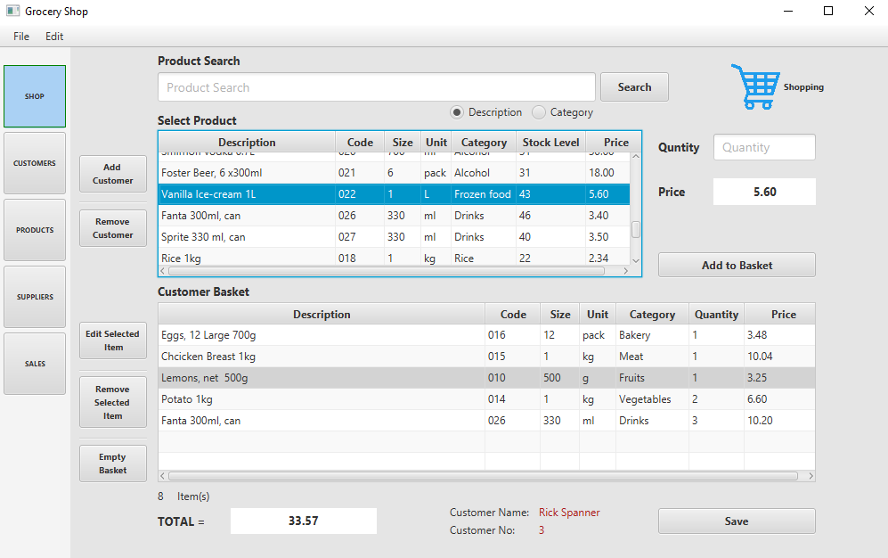
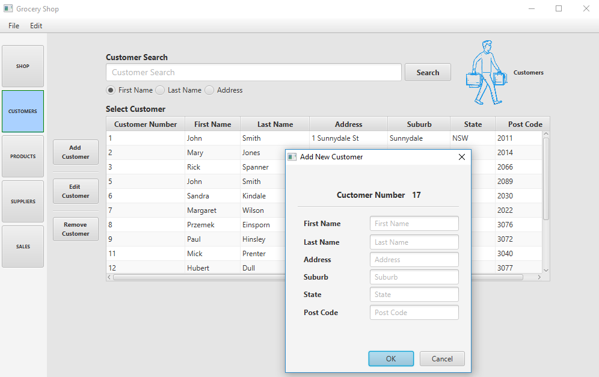
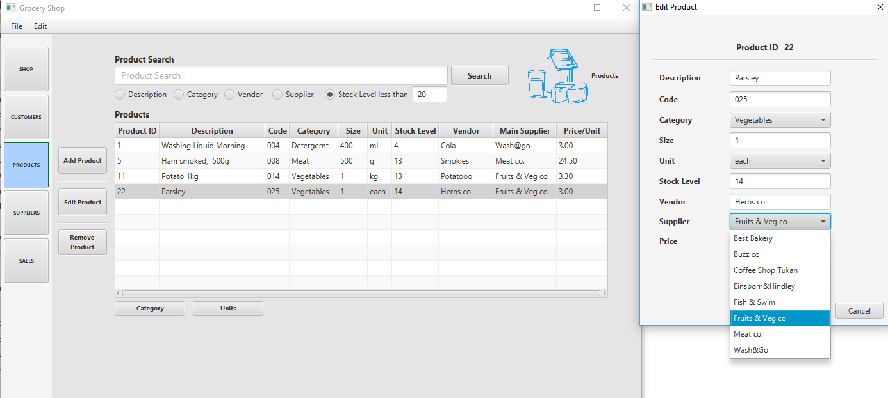
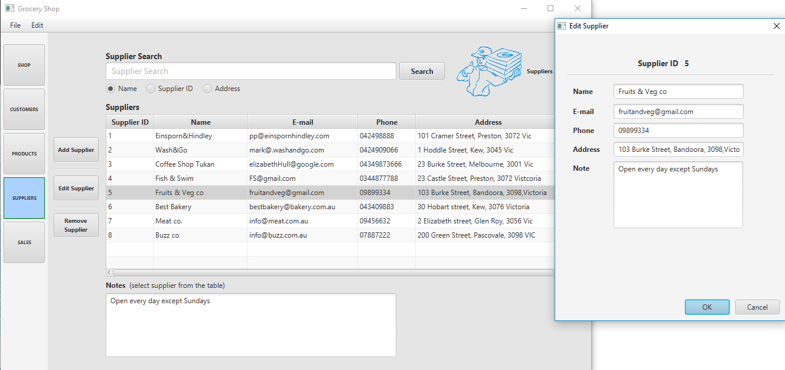
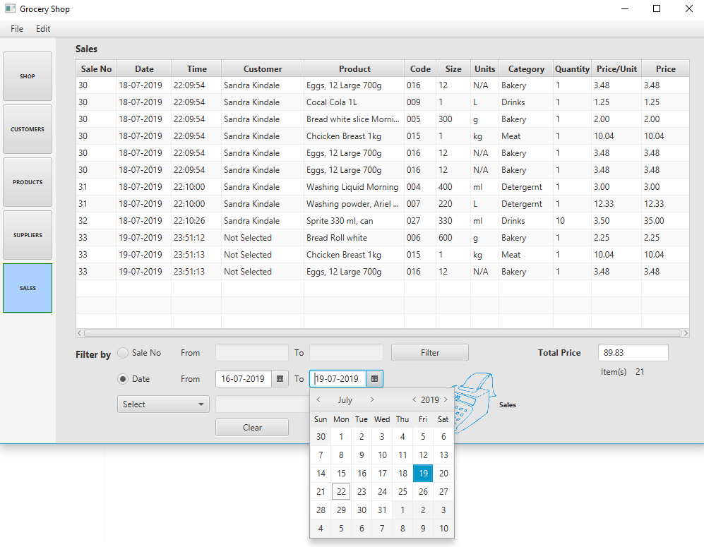

 #Simple Grocery Shop Management JavaFx Application connected with database created in Microsoft SQL Server. Program can save Products, Customers, Suppliers and Sales data in *.txt file.
  
<b>"Shop Page"<b>
   

  
"Customers Page"
   

  
"Products Page"
   

    
"Suppliers Page"
  

    
  "Sales Page"
  

